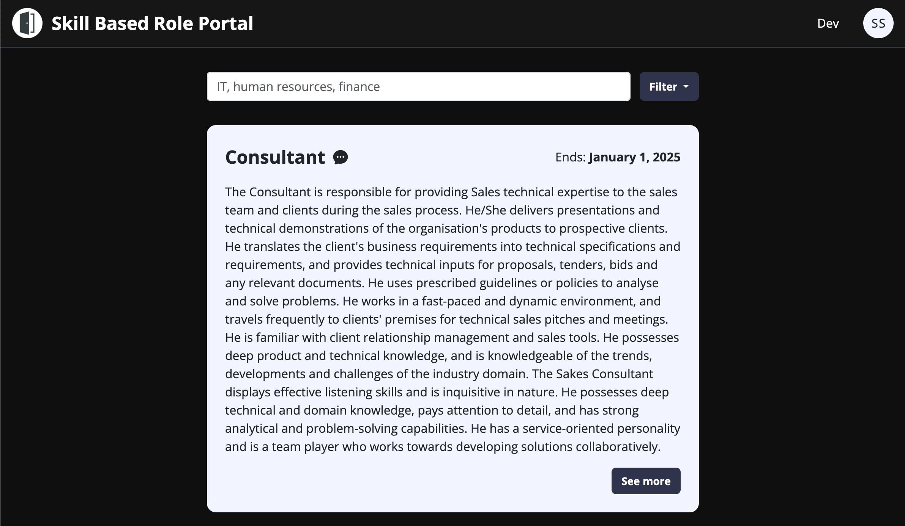

# skillbasedroleportal

Skill Based Role Portal: IS212 G2T2 - Ais Kachang

## Table of Contents

- [Description](#description)
  - [Built with](#built-with)
- [Getting Started](#getting-started)
  - [Prerequisites](#prerequisites)
  - [Frontend](#frontend)
  - [Backend](#backend)
- [Development](#development)
- [Roadmap](#roadmap)
- [Acknowledgements](#acknowledgements)
- [Authors](#authors)

## Description



This project aims to be a skill based role portal that allows users to upskill themselves by searching and applying for company-internal roles based on their skills and experience. HR/admins of the portal will be able to add new role listings. It is built with the frontend using Vue.JS and the backend using Python Flask. The database used is MySQL.

### Built With

- <a href="https://vuejs.org/"></a>
- <a href="https://flask.palletsprojects.com/en/3.0.x/"></a>
- <a href="https://www.mysql.com/"></a>
- <a href="https://getbootstrap.com/"></a>
- <a href="https://tailwindcss.com/"></a>

## Getting Started

### Prerequisites

- [Node.js](https://nodejs.org/en/) (v18.x)
- [MySQL](https://dev.mysql.com/downloads/mysql/) (v8.0)
- [Python](https://www.python.org/downloads/) (v3.11)

### Frontend

For the frontend, simply run the commands below.

```bash
# In root directory
cd frontend
npm install
npm run dev
```

### Backend

For the backend, we will be using Python Flask and a local MySQL server. No API keys are required for this application.

```bash
# In root directory
cd backend
pip/pip3 install -r requirements.txt
flask run
```

Next, create a .env file with the following contents:

```python
# In backend directory
DB_USER=root
DB_PASSWORD=password
DB_HOST=localhost
DB_PORT=3306
```

### Local MySQL database
For the sample data, it is not stored in the repo, but you may use execute [init.sql](https://github.com/darylcwx/skillbasedroleportal/blob/main/init.sql) as the schema for the database, then load a .csv with their respective SQL table columns like so:

```bash
# In root directory
python load_init_sql.py
```

## Development

For development, you may run both the frontend and backend concurrently on separate terminals. On frontend you should see this:

```bash
  VITE v4.4.9  ready in XXX ms

  ➜  Local:   http://localhost:5173/
  ➜  Network: use --host to expose
  ➜  press h to show help
```

And on the backend you should see this:

```bash
 * Debug mode: off
WARNING: This is a development server. Do not use it in a production deployment. Use a production WSGI server instead.
 * Running on http://127.0.0.1:5000
Press CTRL+C to quit
```

This means that once you load the data in correctly, the application will be fully functional.

For styling, refer to :
- [/frontend/vite.config.js](https://github.com/darylcwx/skillbasedroleportal/blob/main/frontend/vite.config.js)
- [/frontend/src/scss/custom.scss](https://github.com/darylcwx/skillbasedroleportal/blob/main/frontend/src/scss/custom.scss)

## Automated Testing

Pre Requisites: Launch Wamp/Mamp and python startServices.py in the root directory

```bash
# In root directory
python startServices.py
```

you may run both the frontend Selenium testing for positive, negative, and boundary test cases as the following:

```bash
# In root directory
pytest -k "positve or negative or boundary" --html=report.html —self-contained-html
```

You may run the backend unit and integration tests for positive, negative and boundary as the following:

```bash
# In /backend/tests/ directory
python unit_tests.py
```

## Roadmap

Tentatively, this application was done up for a school project and will not be maintained in the future.

- [ ] First release (v1.0.0 - 07/11/23)
- [ ] Upcoming release (TBC 😢)

## Acknowledgements

- [Chris Poskitt](https://cposkitt.github.io/)
- [Lee Kok Khing](https://www.linkedin.com/in/lee-kok-khing-b074b69/)
- [SQL Alchemy](https://www.sqlalchemy.org/)
- [Vue 3 Datepicker](https://vue3datepicker.com/)
- [Hero icons](https://heroicons.dev/)

## Authors

- [Xavier Low](https://github.com/xavierlowjunjie)
- [Yoo Jia Ler](https://github.com/ninjachicken100)
- [Jada Tan](https://github.com/jadatanjq)
- [Oh Wen Hai](https://github.com/wenhai-smu)
- [Lem Wai Soon](https://github.com/Waisoon123)
- [Daryl Chua](https://github.com/darylcwx)
